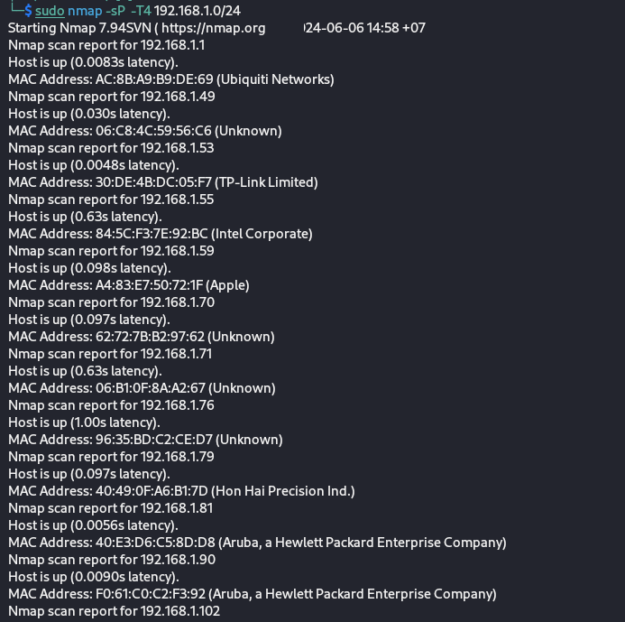
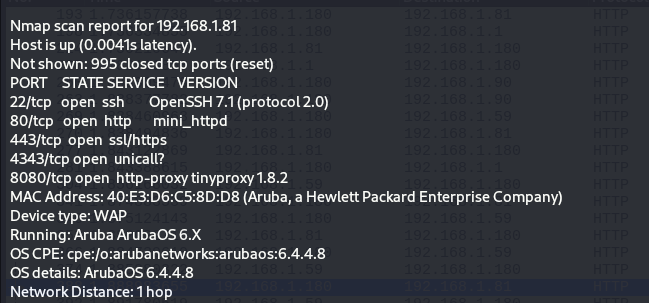
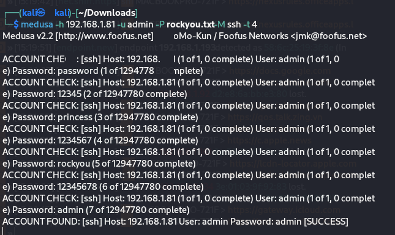
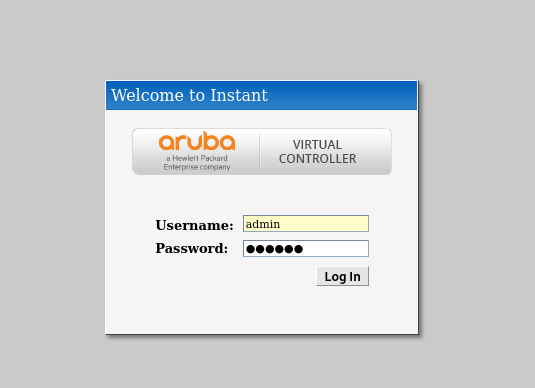
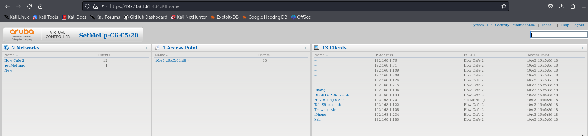
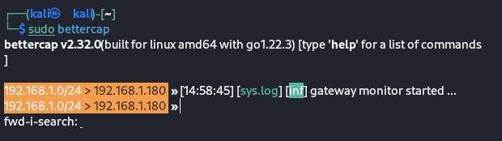
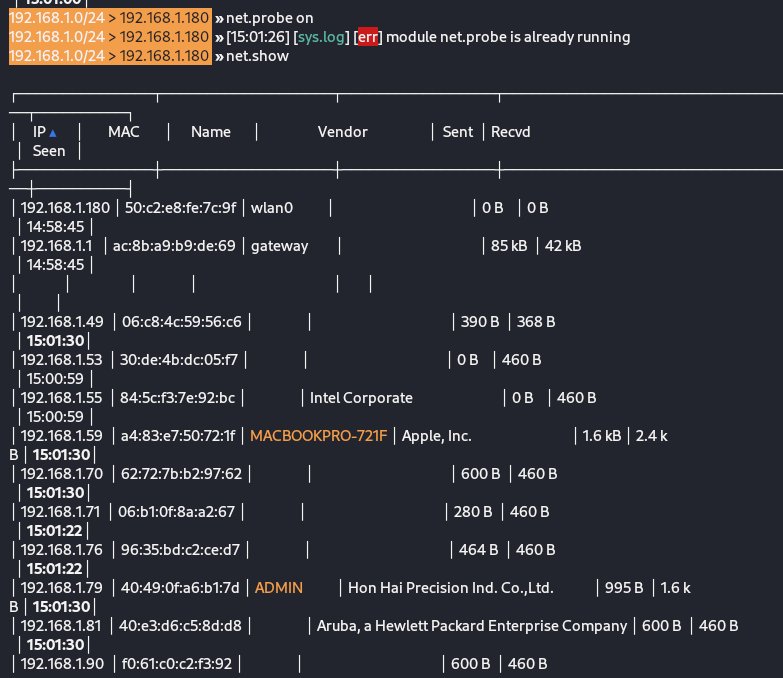
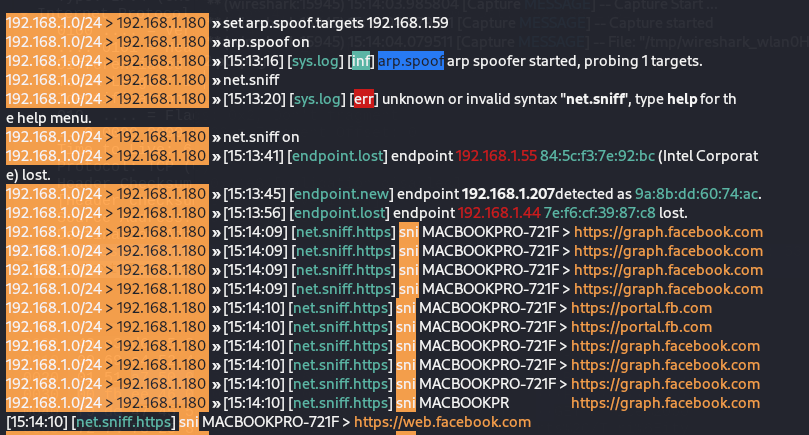

# ARP_Spoofing_A_Coffe_Shop-

# Description :spiral_notepad:

> Feel free to explore our code, documentation, and any additional resources within this repo.
But remmember to use this knowledge responsibly and ethically. Happy Hacking !!! 🚀🔍🔐
>

In this project, I used `nmap` for Step 1 in the Cyber-Kill-Chain, which involves reconnaissance. Next, I launched a MITM (Man-In-The-Middle) attack using `bettercap` to capture and monitor activity on the network. Additionally, I employed `medusa` for a brute-force attack to discover the router's password. After gaining access, I made minor configuration changes to let them know I break into their Wi-Fi.

# Let's do it :ok_hand:

## 1. Nmap 
+ Step 1: To launch a "Ping sweep" to find out IP address of devices connected to the Coffe shop's wifi, I used this command. 
```  
sudo nmap -sP -T4 "IpAddressRange"
```  
You can see every IP addresses near you :V   

The
+ Step 2: But I wanted to know more about the O.S, opening ports and the ports' services, etc. So I used this command. 
```
sudo nmap -sV -O -T4 "IPAddressRange" 
```  
My command looked like this, you can change your IP address based on your targets.  
  

I did notice a speecific device with the IP is: 192.168.1.81, so i took a closer look at it.       
  

*** The MAC address show us that this is an Aruba's device and it was even running Aruba O.S => This must be a router. 

+ Step 3: Using brute-force to find its password:  
In this step, i used medusa, because this one is my fav, but you can use `hydra`, `john the ripper` instead.
And i downloaded the rockyou dictionary which is one of the most common dictionary for brute-force, you can easily download it on the Internet or make your own dictionary.  
The command was like this 

```
sudo medusa -h "IpAddress" -u "username" -P "dictionary"  -M "connection type" -T "number of thread"
```

  

As you can see in the last line, i found the password which is: admin (they didn't give a shit about changing the default password lmao :V)

+ Step 4: Get in and do some little tricks   
Enter the Ip address of this router to your webrowser and you can go to the configuration website.  


I was in, so this time i just added a new wifi named after my fav girls(my mother's friend :v) as a sign that i was there.  
*** They have better change the password ASAP for avoiding any futher risks. 



### 2. Bettercap 
Have you had curiosity about what the person next to you is laughing about when they’re sitting in a coffee shop, engrossed in their screen? (Maybe it's just a stupid short TikTok video about a girl twerking her butt or smth like that). If your answear is YES, so this one is for you.  
+ Step 1:Launch Bettercap  
using this common to enter bettercap.  
```
sudo nmap bettercap
```
Bettercap should be like this  


+ Step 2: If you forget or skip the lesson about Nmap above, this one is for you:  
We will display ever device in our wifi with these commands. 
```
net.probe on 

net.show 
```
Voila  


+ Step 3: Choose a target
The Mac Girl behind me looked extremly suspicious, so my eyes was on her :V (kidding). After analying what Mac model she was using, i found that her MacPro's IP was 192.168.1.59.  
I used ARP spoofing attack which is a technique where an attacker sends spoofed Address Resolution Protocol (ARP) messages onto a local area network. The goal is to associate the attacker’s MAC address with the IP address of another host (such as the default gateway). (Thanks to Copilot :V). I set the target for better with the command below, then start arp.spoof, finally sniff sniff 
```
set arp.spoof.targets "IPaddress" 

arp.spoof on

net.sniff on 
```
  

Oh, she was just surfing facebook, not watching tiktok as i thougt. Luckily not a cancer :V 

+Step 5: We can redirect the traffic to our own website using DNS spoofing but i will show it later, if i still remmember this project :V. 


